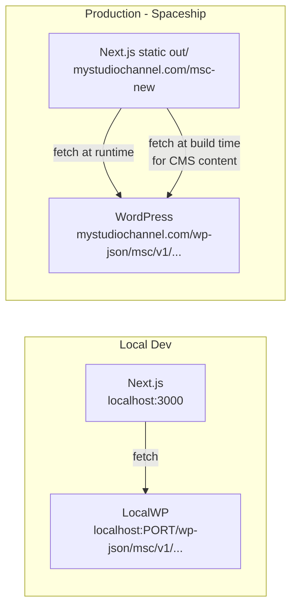

# Headless WordPress Backend -- Full Integration Plan

## Architecture



**Key constraint preserved:** `output: 'export'` stays. Dynamic data (booking, signup) fetches from the browser at runtime. CMS content (hero, shows, testimonials) fetches at build time -- a `npm run build` publishes WP content changes to the static site.

---

## What gets built

### A -- WordPress custom API plugin (PHP)

New file: `wp-content/plugins/msc-api/msc-api.php` (added to both LocalWP and Spaceship WP).

Three endpoints registered under `msc/v1`:

- `POST /wp-json/msc/v1/booking-request` -- saves booking to a custom post type `msc_booking`; triggers `wp_mail` confirmation to admin.
- `GET /wp-json/msc/v1/booking-availability?date=YYYY-MM-DD` -- returns booked slots for a date so the calendar knows what to grey out.
- `POST /wp-json/msc/v1/signup` -- saves an email + name to a custom post type `msc_lead`; optionally triggers a welcome email.

Security: public POSTs protected by a shared secret header (`X-MSC-Key`) checked against a WP option. No nonce needed for static-to-WP calls. All functions prefixed `msc_` per project rules.

### B -- Next.js lib files (TypeScript)

- [`lib/booking.ts`](lib/booking.ts) -- replace the mock `submitBookingRequest` with a real `fetch` POST to `NEXT_PUBLIC_MSC_BOOKING_URL`. Add `fetchBookingAvailability(date)` for live slot data.
- `lib/signup.ts` -- new file, `submitSignup({ email, name })` POSTs to `NEXT_PUBLIC_MSC_SIGNUP_URL`.
- `lib/cms.ts` -- new file, fetch functions that pull CMS content from WP REST + ACF at build time (hero slides, show cards, testimonials). Falls back to the current hardcoded values if the API is unreachable.

### C -- Environment variables

`.env.local` (local, never committed):
```
NEXT_PUBLIC_MSC_BOOKING_URL=http://localhost:PORT/wp-json/msc/v1/booking-request
NEXT_PUBLIC_MSC_SIGNUP_URL=http://localhost:PORT/wp-json/msc/v1/signup
NEXT_PUBLIC_MSC_API_URL=http://localhost:PORT/wp-json/msc/v1
MSC_API_KEY=your-local-secret
```

`.env.production` (Spaceship / CI):
```
NEXT_PUBLIC_MSC_BOOKING_URL=https://mystudiochannel.com/wp-json/msc/v1/booking-request
NEXT_PUBLIC_MSC_SIGNUP_URL=https://mystudiochannel.com/wp-json/msc/v1/signup
NEXT_PUBLIC_MSC_API_URL=https://mystudiochannel.com/wp-json/msc/v1
MSC_API_KEY=your-live-secret
```

### D -- WordPress ACF content (optional Phase 2)

ACF field groups for: Hero Slides, Show Cards, Testimonials, Process Steps. Exported as JSON and committed to repo. Next.js `lib/cms.ts` fetches via `/wp-json/acf/v3/options/...` at build time. Components receive data as props instead of hardcoded arrays.

---

## Phased delivery

**Phase 1 -- Live booking + signup (touches the least code, highest value)**
1. Build and install the WordPress plugin on LocalWP.
2. Wire `lib/booking.ts` to the real endpoint; wire the contact form's email field to `lib/signup.ts`.
3. Test locally end-to-end: pick date + time, submit, verify `msc_booking` CPT entry appears in WP Admin.
4. Deploy plugin to Spaceship WP, update `.env` to point at live URL, rebuild.

**Phase 2 -- CMS-driven content**
5. Register ACF field groups for Hero, Shows, Testimonials.
6. Write `lib/cms.ts` fetch functions with hardcoded fallbacks.
7. Update 2-3 components (`hero-section.tsx`, `demos-section.tsx`, `testimonials-section.tsx`) to accept props from `lib/cms.ts`.
8. Rebuild; confirm content from WP Admin appears in static output.

---

## Files changed summary

- **New (WordPress):** `wp-content/plugins/msc-api/msc-api.php`
- **Modified:** [`lib/booking.ts`](lib/booking.ts) -- replace mock with real fetch
- **New (Next.js):** `lib/signup.ts`, `lib/cms.ts`
- **New:** `.env.local`, `.env.example`
- **Modified (Phase 2):** `components/hero-section.tsx`, `components/demos-section.tsx`, `components/testimonials-section.tsx`
- **Docs:** `Development.md`, `ReCall.md` updated after each phase
