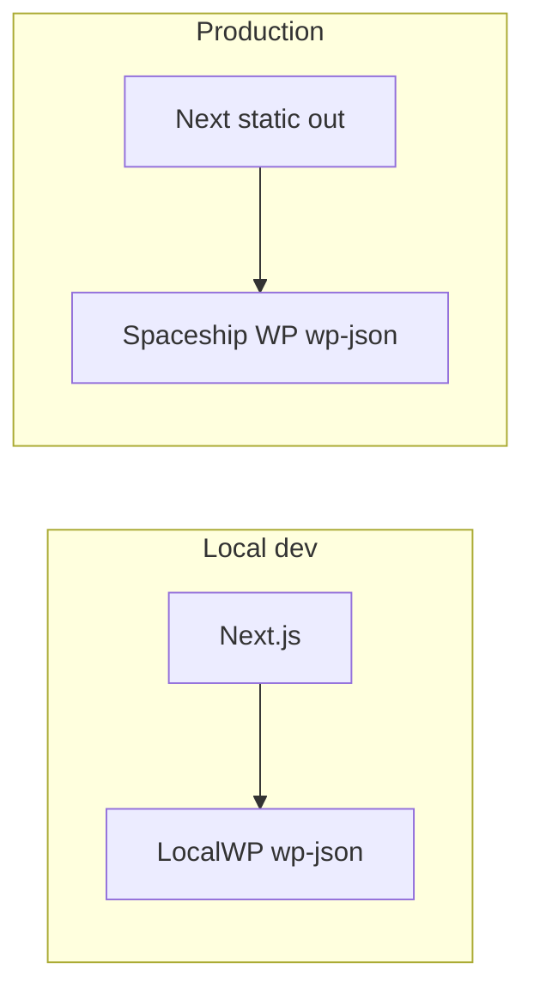

# Site plans — Next.js backend, CMS, and data

Reference doc for choosing and implementing how the MSC Next site (`msc-new`) connects to a database, admin panel, and signup flows. Last updated for review alongside [Development.md](./Development.md), [ReCall.md](./ReCall.md), and [Restore-Points.md](./Restore-Points.md).

---

## Original goals (summary)

- Next.js marketing site at `https://mystudiochannel.com/msc-new/` looks good but **does not persist data** yet.
- Want a **free or low-cost** solution, **simple admin** (edit text, images, posts like WordPress).
- Need to **store emails** for signups / verification-style flows.
- Comfortable with **WordPress**; also curious about **headless WordPress**, **Payload CMS**, **Supabase**, **Neon**, **Firebase**, **Backblaze**, etc.
- Traffic is modest (not millions of users).

---

## Critical constraint: static export vs full-stack Next

**Current state (Payload Phase A):** **`output: 'export'` was removed.** The app is a **full Next.js + Payload** bundle: deploy with **`next build` + `next start`** (or a host’s Next integration), not by uploading **`out/`** alone.

**Historical note:** Earlier versions shipped only static files from **`out/`**. That workflow conflicts with Payload’s admin and **`/api`** routes.

---

## Option comparison (short)

| Option | Admin / CMS | Typical DB | Fit with current static `out/` | Notes |
|--------|-------------|------------|----------------------------------|--------|
| **Headless WordPress** | WP Admin (familiar) | MySQL (often already on host) | **Strong** — fetch REST at build time and/or browser | You already have WP **live on Spaceship** and **LocalWP** locally. |
| **Payload 3** (this repo) | Payload admin | SQLite locally; Postgres in prod | **In use** — Node host required; see Development.md | Neon/Postgres recommended for production. |
| **Supabase** | Not a full marketing CMS by itself | Postgres | Can work with static site via client SDK | Great for **auth / signups / tables**; pair with WP or Payload for “edit all copy.” |
| **Firebase** | Not WP-like CMS | Firestore etc. | Similar to Supabase pattern | Good for auth/notifications; still need a content story. |
| **Backblaze B2** | N/A | Object storage | N/A | **Files/backups**, not a replacement for CMS + structured app data. |

---

## Recommendation snapshot

- **Simplest path aligned with “WordPress-like admin” + existing hosting:** **headless WordPress** (REST API or WPGraphQL) on your current install; Next stays static or uses client `fetch` for live actions (booking, signup).
- **“Everything in one Next repo” + you accept Node hosting + Postgres:** **Payload + Neon** is coherent — plan a migration off pure static export.
- **Signups / verification heavy:** consider **Supabase** (or WP endpoints) as the store for leads; can combine with headless WP for content.

---

## Headless WordPress — architecture (approved direction)

**Your setup:** WordPress **live on Spaceship** and **LocalWP** for local dev — ideal for dev → deploy of the same plugin/theme.

- **Booking / signup:** browser `fetch` to `https://yoursite.com/wp-json/msc/v1/...` (CORS must allow the Next origin if cross-domain).
- **CMS content (hero, testimonials, etc.):** optional **build-time** fetch so copy/images update after `npm run build`; or hybrid.

### Planned WordPress side (Phase 1)

- Custom plugin (e.g. `msc-api`) registering namespace `msc/v1`:
  - `POST /booking-request` — persist booking (e.g. CPT `msc_booking`), optional `wp_mail` to admin.
  - `GET /booking-availability?date=YYYY-MM-DD` — return booked slots for the schedule UI.
  - `POST /signup` — persist lead (e.g. CPT `msc_lead`).
- **Security for public POSTs:** shared secret header (e.g. `X-MSC-Key`) vs option stored in WP; document in `.env` on Next side.

### Planned Next.js side (Phase 1)

- Extend [lib/booking.ts](../lib/booking.ts) — real `fetch` when `NEXT_PUBLIC_MSC_BOOKING_URL` is set; add availability fetch if needed.
- Add `lib/signup.ts` — POST to signup endpoint.
- **Env:** `NEXT_PUBLIC_MSC_*` URLs + server/client key handling as designed (see Development.md when wired).

### Phase 2 (optional CMS)

- ACF (or similar) field groups for hero, demos, testimonials; `lib/cms.ts` with **fallbacks** to current hardcoded content; rebuild to publish CMS changes.

---

## Payload — implemented (Phase A)

See [Development.md](./Development.md) for run commands, env, import map, and hydration notes.

**Done:** `withPayload`, `app/(payload)` routes, `app/(site)` marketing home, **`payload.config.ts`**, SQLite adapter, **`users`**, **`media`**, **`bookings`**, **`leads`**; globals **`homepage`** (hero from Media) and **`site-settings`** (SEO). **`lib/booking.ts`** posts to **`/api/bookings`** when `NEXT_PUBLIC_MSC_BOOKING_URL=payload`. Marketing hero and metadata read from CMS when populated; otherwise built-in defaults. Admin includes a visible **Log out** nav link plus **`/admin/logout`**.

**You do next:** copy **`.env.example` → `.env.local`**, run **`npm run dev:payload`**, in **`/admin`** open **Site → Homepage**: upload images in **Media**, add hero slides; optional **Site settings** for title/tagline. Test **`/`** and booking flow.

**Phase B (production):** choose Node host (Vercel, Railway, VPS); switch **`payload.config.ts`** to **`@payloadcms/db-postgres`** and Neon (or other Postgres); lock down public **`bookings`** create (API key / rate limit).

---

## If you must return to static-only hosting

Remove Payload, restore **`output: 'export'`**, and use **headless WordPress** or a **separate** Payload instance the static site calls over HTTPS.

---

## MCP / tooling (optional)

- Supabase MCP, Postgres/Neon MCP, Next.js DevTools MCP — useful when those services are in use.
- Payload-related MCP packages exist; only relevant after Payload is in the project.

---

## Related docs in this repo

- [Development.md](./Development.md) — stack, Payload, schedule dialog, booking env.
- [ReCall.md](./ReCall.md) — session memory and checkpoints.
- [Restore-Points.md](./Restore-Points.md) — dated restore checkpoints and `payload.sqlite` backup.
- [Run-Next-JS.md](./Run-Next-JS.md) — build and serve commands.

---

## Changelog

| Date | Note |
|------|------|
| 2026-04-08 | Created `Site-Plans.md` — consolidates backend/CMS options, static-export vs Payload, headless WP architecture, and phased plan for reference. |
| 2026-04-08 | **Payload Phase A** — integrated in-repo (`withPayload`, `(payload)` routes, SQLite, `bookings`, booking POST); static export removed. |
| 2026-04-08 | **Admin ops** — documented visible sidebar “Log out”, `/admin/logout`, import map path, and extension-related hydration troubleshooting (see Development.md). |
| 2026-04-08 | **Homepage in CMS** — globals for hero + site SEO; **Leads** collection; [Restore-Points.md](./Restore-Points.md) checkpoint **RP-2026-04-08-cms-globals**. |
